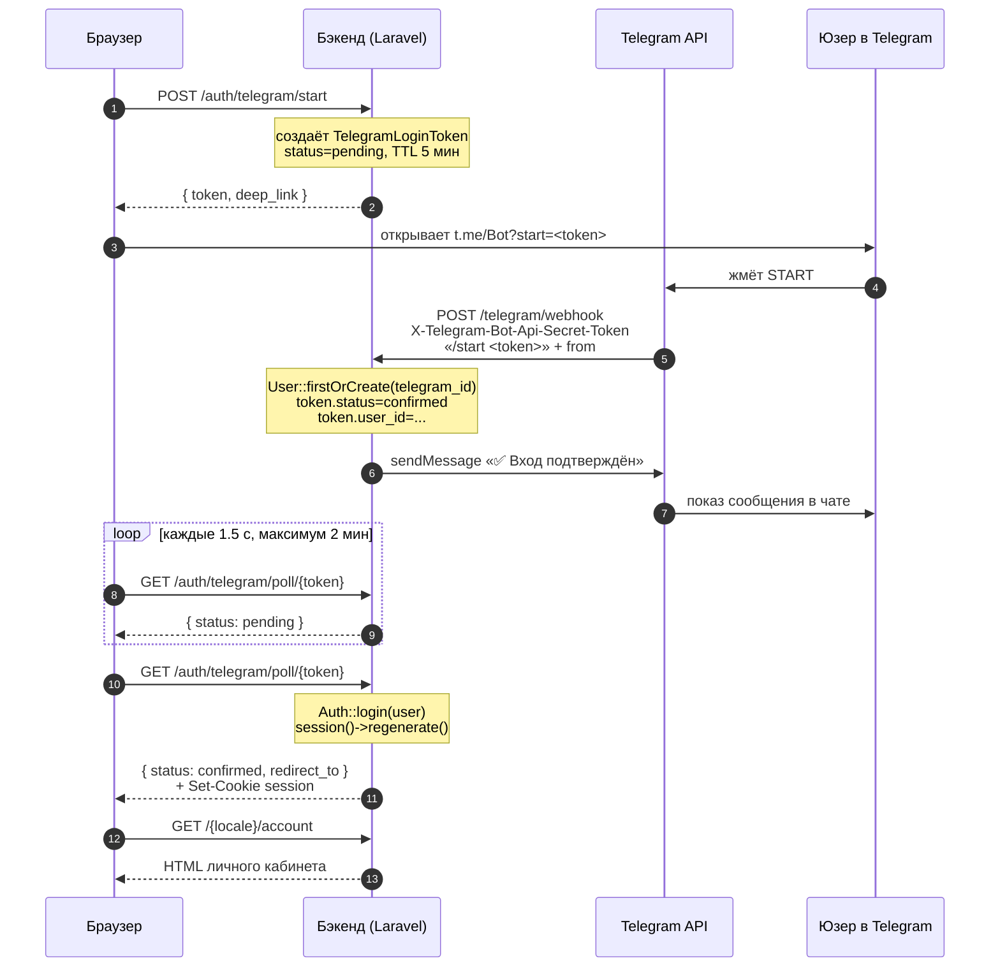

# TDD-план: вход и профиль пользователя через Telegram

> Статус: черновик для ревью. Код не писать, пока пользователь не одобрит этот план.

**Версия:** 1.0
**Дата:** 2026-05-09
**Автор:** инженерная команда

---

## 1. Цель

Дать клиенту PrintLab личный кабинет: войти, увидеть свои заявки, повторить заказ. Авторизация — через Telegram, без SMS-OTP и без пароля.

Telegram выбран как первичный канал входа, потому что:

- Telegram распространён в Узбекистане сильнее, чем массово настроенный SMS-приём (нет платы за SMS-шлюз, нет проблем с операторами и роумингом).
- Реализация быстрее OTP: не нужен SMS-провайдер, доменное согласование с операторами и compliance вокруг хранения номеров.
- Telegram даёт нам устойчивый идентификатор (`telegram_id`), верифицированное имя и при желании номер телефона (через WebApp `requestContact`) — этого достаточно для матчинга с уже существующими заявками по `customer_phone`.
- Не требует настройки почты (которой у части аудитории просто нет).

OTP по SMS можно будет добавить второй фазой, но в MVP его нет.

## 2. Объём MVP

В MVP сделаем:

- Вход через Telegram **bot deep-link** (`https://t.me/<bot>?start=<token>`).
- Создание/обновление `User` с полями `telegram_id`, `telegram_username`, `first_name`, `last_name`, `photo_url`, `phone` (опционально).
- Личный кабинет: страница `/{locale}/account` со списком заявок текущего пользователя.
- Привязку гостевых заявок (по совпадению `customer_phone`) к новому пользователю при первом входе, если телефон уже подтверждён.
- При создании новой заявки авторизованным пользователем — автоматическая привязка `order_request.user_id`.
- Logout.
- Полное покрытие feature-тестами; интеграция с Telegram замоканная через интерфейс `TelegramAuthGateway`.

Не входит в MVP:

- Telegram Login Widget на десктопе (см. §11 «Альтернативы» — оставляем как фазу 2).
- Telegram WebApp (`tg.WebApp.initData`) внутри мини-аппа.
- SMS-OTP fallback.
- Email/пароль регистрация.
- Восстановление аккаунта при смене Telegram.
- 2FA, управление сессиями.
- Push-нотификации в Telegram о статусе заявки (отдельный TDD).
- Профиль в Filament-админке (там продолжает работать обычный email+password гард).

## 3. Архитектура

### 3.1 Поток входа (bot deep-link)



Пояснение:

- На странице логина у нас две кнопки: «Открыть Telegram» (deep-link) и «Я вернулся, проверить вход» (на случай отказа JS / мобильных браузеров без поллинга).
- Front-end поллит `GET /auth/telegram/poll/{token}` каждые 1.5 с, максимум 2 минуты. Когда `status=confirmed` — backend ставит cookie сессии и отдаёт `redirect_to` в JSON, фронт делает `window.location.href`.
- На стороне бота принимаем апдейты через webhook. Webhook регистрируется один раз скриптом `telegram:webhook:set`.

### 3.2 Поток с уже существующим пользователем

`telegram_id` уникален. При повторном `/start <token>` от того же `telegram_id` мы находим юзера и просто логиним.

### 3.3 Привязка гостевых заявок

Если у пользователя в Telegram есть «Поделиться номером» (можно попросить кнопкой бота `KeyboardButton.requestContact`), бот сохраняет `phone_number` в `users.phone`. После первого подтверждения мы:

- Ищем `OrderRequest` с `user_id IS NULL AND customer_phone = users.phone`.
- Проставляем им `user_id`.

Если пользователь не отдал номер — заявки не привязываются автоматически, в UI кабинета показываем кнопку «Прикрепить мои предыдущие заявки», которая просит ввести номер вручную (фаза 2). В MVP достаточно варианта «бот спросил номер».

### 3.4 Слои кода

```
HTTP
  routes/web.php                        ──── /{locale}/login, /{locale}/account, /auth/...
  routes/api.php                        ──── (опционально) JSON poll endpoint
  app/Http/Controllers/Auth/TelegramLoginController.php
  app/Http/Controllers/AccountController.php
  app/Http/Middleware/RedirectIfNotAuthenticated.php  (используем стандартный auth)
Use cases
  app/UseCases/Auth/StartTelegramLoginUseCase.php
  app/UseCases/Auth/ConfirmTelegramLoginUseCase.php
  app/UseCases/Auth/AttachGuestOrderRequestsUseCase.php
Services
  app/Services/Telegram/TelegramAuthGateway.php       (interface)
  app/Services/Telegram/HttpTelegramAuthGateway.php   (prod, через Laravel Http к api.telegram.org)
  app/Services/Telegram/FakeTelegramAuthGateway.php   (для local/test)
  app/Services/Telegram/TelegramWebhookHandler.php
Models
  app/Models/User                          (расширяем)
  app/Models/TelegramLoginToken            (новое)
Providers
  app/Providers/TelegramAuthServiceProvider.php       (binding fake/http)
```

## 4. Переменные окружения

Добавить в `.env.example`:

```env
TELEGRAM_BOT_USERNAME=PrintLabUzBot
TELEGRAM_BOT_TOKEN=
TELEGRAM_WEBHOOK_SECRET=
TELEGRAM_AUTH_DRIVER=fake
TELEGRAM_LOGIN_TOKEN_TTL=300
```

Правило окружений:

- `local`, `testing` → `TELEGRAM_AUTH_DRIVER=fake`. Никаких походов в `api.telegram.org`. Фейковый gateway умеет:
  - сгенерировать токен,
  - симулировать `/start <token>` от заданного `telegram_id`,
  - вернуть «обновление» в тестах.
- `staging`, `production` → `TELEGRAM_AUTH_DRIVER=http`. Реальный бот, реальный webhook.

`TELEGRAM_WEBHOOK_SECRET` — секретная строка, которую мы передаём в `setWebhook` параметром `secret_token`. Telegram потом передаёт её в заголовке `X-Telegram-Bot-Api-Secret-Token`. Запросы без этого заголовка или с неправильным значением отклоняем (HTTP 401).

`TELEGRAM_LOGIN_TOKEN_TTL` — сколько секунд токен валиден. Default 300 (5 минут).

В `config/services.php`:

```php
'telegram' => [
    'driver' => env('TELEGRAM_AUTH_DRIVER', 'fake'),
    'bot_username' => env('TELEGRAM_BOT_USERNAME'),
    'bot_token' => env('TELEGRAM_BOT_TOKEN'),
    'webhook_secret' => env('TELEGRAM_WEBHOOK_SECRET'),
    'login_token_ttl' => (int) env('TELEGRAM_LOGIN_TOKEN_TTL', 300),
],
```

## 5. Изменения базы данных

### 5.1 Расширение `users`

Миграция `2026_05_10_000000_add_telegram_columns_to_users_table.php`:

```php
Schema::table('users', function (Blueprint $table) {
    $table->unsignedBigInteger('telegram_id')->nullable()->unique()->after('id');
    $table->string('telegram_username')->nullable()->after('telegram_id');
    $table->string('first_name')->nullable()->after('name');
    $table->string('last_name')->nullable()->after('first_name');
    $table->string('phone')->nullable()->index()->after('email');
    $table->string('photo_url')->nullable()->after('phone');
    $table->string('locale', 5)->nullable()->after('photo_url');
    // email и password остаются nullable для Telegram-юзеров
    $table->string('email')->nullable()->change();
    $table->string('password')->nullable()->change();
});
```

Замечания:

- `email` и `password` становятся `nullable`, потому что Telegram-пользователь может вообще не иметь email. Filament-админ продолжает работать: у admin-юзера всегда есть email и пароль из сидера.
- `telegram_id` уникален и `nullable` — админам он не нужен.
- `phone` индексируем для быстрого поиска при привязке заявок.

### 5.2 Таблица `telegram_login_tokens`

Миграция `2026_05_10_000100_create_telegram_login_tokens_table.php`:

```php
Schema::create('telegram_login_tokens', function (Blueprint $table) {
    $table->id();
    $table->string('token', 64)->unique();      // безопасный random
    $table->string('status')->default('pending'); // pending | confirmed | expired
    $table->foreignId('user_id')->nullable()->constrained()->nullOnDelete();
    $table->string('ip_address', 45)->nullable();
    $table->string('user_agent')->nullable();
    $table->string('redirect_to')->nullable();
    $table->timestamp('confirmed_at')->nullable();
    $table->timestamp('expires_at')->index();
    $table->timestamps();
});
```

### 5.3 Привязка заявок к пользователю

Миграция `2026_05_10_000200_add_user_id_to_order_requests_table.php`:

```php
Schema::table('order_requests', function (Blueprint $table) {
    $table->foreignId('user_id')->nullable()->after('id')->constrained()->nullOnDelete();
    $table->index(['user_id', 'created_at']);
});
```

Заявки гостей продолжают создаваться без `user_id`. Если пользователь авторизован при сабмите — `user_id` ставится сразу.

## 6. Маршруты

В `routes/web.php`:

```php
// Внутри prefix({locale})->group(...)
Route::get('/login', [TelegramLoginController::class, 'show'])->name('login');
Route::post('/auth/telegram/start', [TelegramLoginController::class, 'start'])
    ->name('auth.telegram.start');
Route::get('/auth/telegram/poll/{token}', [TelegramLoginController::class, 'poll'])
    ->name('auth.telegram.poll');
Route::post('/auth/logout', [TelegramLoginController::class, 'logout'])
    ->middleware('auth')
    ->name('auth.logout');

Route::middleware('auth')->group(function () {
    Route::get('/account', [AccountController::class, 'index'])->name('account.index');
    Route::get('/account/order-requests/{orderRequest}', [AccountController::class, 'show'])
        ->name('account.order-requests.show');
});
```

Webhook (без `{locale}`-префикса, не публичный):

```php
Route::post('/telegram/webhook', [TelegramWebhookController::class, 'handle'])
    ->name('telegram.webhook');
```

`TelegramWebhookController` сразу делегирует в `TelegramWebhookHandler`. Контроллер проверяет заголовок `X-Telegram-Bot-Api-Secret-Token`. CSRF для этого роута надо отключить (добавить путь в `bootstrap/app.php` `validateCsrfTokens` `except`).

## 7. Поведение

### 7.1 `StartTelegramLoginUseCase`

- Получает `redirect_to` (опционально), IP, User-Agent.
- Создаёт `TelegramLoginToken` со случайным токеном (64 символа, `bin2hex(random_bytes(32))`), `status=pending`, `expires_at = now() + ttl`.
- Возвращает DTO `{ token, deep_link, expires_at }`. `deep_link` = `https://t.me/<bot_username>?start=<token>`.

### 7.2 Webhook handler

Принимает `Update` от Telegram. Нас интересует только сообщение с текстом, начинающимся на `/start `:

- Парсим `token`.
- Ищем `TelegramLoginToken` со `status=pending` и не истёкший. Если нет — отвечаем боту нейтральным сообщением «Ссылка устарела» и возвращаем 200 (Telegram не должен ретраить).
- Берём `from` (telegram user) из апдейта.
- Через `ConfirmTelegramLoginUseCase`:
  - `User::firstOrCreate(['telegram_id' => $tgId])` с заполнением `first_name`, `last_name`, `telegram_username`, `photo_url`, `locale`.
  - Если у пользователя уже есть `phone` и среди `order_requests` с `user_id IS NULL` есть совпадающие — прогоняем `AttachGuestOrderRequestsUseCase`.
  - Обновляем токен: `status=confirmed`, `user_id=…`, `confirmed_at=now()`.
- Отвечаем боту сообщением «Вход подтверждён, возвращайтесь на сайт.»

В MVP бот не отправляет кнопку «Поделиться номером» — это фаза 2.

### 7.3 Poll endpoint

`GET /auth/telegram/poll/{token}`:

- Если токен `pending` и не истёк — `{ status: 'pending' }`, HTTP 200.
- Если `expired` или истёк по времени — `{ status: 'expired' }`, HTTP 410.
- Если `confirmed` — на сервере вызываем `Auth::login($user, true)`, регенерим сессию, возвращаем `{ status: 'confirmed', redirect_to: '...' }`. Cookie ставится автоматически.
- Если токен принадлежит чужому IP — игнорируем (токен привязан к IP, чтобы хешированный URL нельзя было «угнать», подделав открытие). В MVP проверка IP мягкая: предупреждение в логах, но работает.

### 7.4 Login UI

Минимальная Blade-страница `resources/views/auth/login.blade.php`:

- Лого, h1 «Войти через Telegram».
- Большая красная кнопка «Открыть Telegram» (открывает `deep_link` в новой вкладке).
- Маленький текст «Не получилось? Подождите 5 секунд и обновите страницу.»
- JS: на загрузке вызывает `/auth/telegram/start`, получает `deep_link`, ставит его в `href` кнопки. После клика начинает поллинг `/auth/telegram/poll/{token}`. На `confirmed` делает `window.location = redirect_to`.

### 7.5 Account page

`resources/views/account/index.blade.php`:

- Шапка с именем (`first_name last_name` или `telegram_username`) и аватаром (`photo_url` или дефолтный SVG).
- Список заявок текущего пользователя (`OrderRequest::where('user_id', auth()->id())->latest()`), карточками. Поля: ID, дата, сумма, статус (через `OrderRequestStatus::label()`), кнопка «Открыть».
- Кнопка «Выйти» → `POST /auth/logout`.
- Если заявок нет — текст «У вас пока нет заявок» и кнопка «Открыть конструктор».

## 8. Безопасность

- Webhook валидируется заголовком `X-Telegram-Bot-Api-Secret-Token`. Без него — 401.
- `TELEGRAM_BOT_TOKEN` не выводится во фронт. Фронт получает только `bot_username` (он публичен) и `token` логин-сессии.
- `TelegramLoginToken.token` строго одноразовый: после `confirmed` следующая попытка использовать его → 410.
- TTL 5 минут.
- Rate limit на `/auth/telegram/start` — стандартный Laravel `throttle:30,1` по IP.
- `Auth::login` всегда пересоздаёт сессию (`session()->regenerate()`).
- Webhook добавляется в исключения CSRF.
- На полл-endpoint ставим `throttle:120,1`.

## 9. Тесты

Все feature-тесты используют `RefreshDatabase` и подменяют `TelegramAuthGateway` на `FakeTelegramAuthGateway`.

### 9.1 `tests/Feature/Auth/TelegramLoginFlowTest.php`

- `test_login_page_renders_with_telegram_button`
- `test_start_endpoint_creates_pending_token_and_returns_deep_link`
- `test_poll_returns_pending_when_token_unconfirmed`
- `test_poll_returns_expired_for_expired_token`
- `test_poll_returns_confirmed_and_logs_user_in_after_webhook`
- `test_full_flow_creates_user_with_telegram_data`
- `test_full_flow_reuses_existing_user_by_telegram_id`
- `test_logout_clears_session`

### 9.2 `tests/Feature/Auth/TelegramWebhookTest.php`

- `test_webhook_rejects_request_without_secret_header`
- `test_webhook_rejects_request_with_wrong_secret`
- `test_webhook_with_valid_start_token_confirms_login`
- `test_webhook_with_unknown_token_responds_200_and_does_not_log_in`
- `test_webhook_with_expired_token_responds_200_and_does_not_log_in`
- `test_webhook_ignores_non_start_messages`

### 9.3 `tests/Feature/Auth/AccountPageTest.php`

- `test_guest_is_redirected_to_login`
- `test_authenticated_user_sees_their_order_requests_only`
- `test_account_page_shows_empty_state_when_no_order_requests`

### 9.4 `tests/Feature/Auth/AttachGuestOrderRequestsTest.php`

- `test_attaches_guest_order_requests_with_matching_phone_on_first_login`
- `test_does_not_attach_order_requests_of_other_phones`
- `test_does_not_re_attach_already_owned_order_requests`

### 9.5 `tests/Feature/Auth/AuthenticatedOrderRequestStoreTest.php`

- `test_authenticated_user_creates_order_request_with_user_id_set`
- `test_guest_user_still_creates_order_request_without_user_id`

### 9.6 Unit

- `tests/Unit/Auth/TelegramLoginTokenTest.php`:
  - `test_token_is_expired_after_ttl`
  - `test_token_is_marked_confirmed`
- `tests/Unit/Auth/FakeTelegramAuthGatewayTest.php`:
  - `test_simulates_start_command_and_records_user`

## 10. Файлы

### 10.1 Создать

- `database/migrations/2026_05_10_000000_add_telegram_columns_to_users_table.php`
- `database/migrations/2026_05_10_000100_create_telegram_login_tokens_table.php`
- `database/migrations/2026_05_10_000200_add_user_id_to_order_requests_table.php`
- `app/Models/TelegramLoginToken.php`
- `app/Http/Controllers/Auth/TelegramLoginController.php`
- `app/Http/Controllers/Auth/TelegramWebhookController.php`
- `app/Http/Controllers/AccountController.php`
- `app/UseCases/Auth/StartTelegramLoginUseCase.php`
- `app/UseCases/Auth/ConfirmTelegramLoginUseCase.php`
- `app/UseCases/Auth/AttachGuestOrderRequestsUseCase.php`
- `app/Services/Telegram/TelegramAuthGateway.php` (interface)
- `app/Services/Telegram/HttpTelegramAuthGateway.php`
- `app/Services/Telegram/FakeTelegramAuthGateway.php`
- `app/Services/Telegram/TelegramWebhookHandler.php`
- `app/Services/Telegram/Dto/TelegramUser.php`
- `app/Providers/TelegramAuthServiceProvider.php`
- `resources/views/auth/login.blade.php`
- `resources/views/account/index.blade.php`
- `resources/views/account/show.blade.php`
- `lang/ru/auth.php` (новые ключи)
- `lang/uz/auth.php` (новые ключи)
- Все тестовые файлы из §9.

### 10.2 Изменить

- `app/Models/User.php` — `$fillable`, `$casts`, метод `orderRequests()`.
- `app/Models/OrderRequest.php` — `$fillable` += `user_id`, метод `user()`.
- `app/Http/Controllers/OrderRequestController.php` — при `auth()->check()` ставим `user_id`.
- `app/UseCases/OrderRequests/CreateOrderRequestUseCase.php` — параметр `?int $userId`.
- `routes/web.php` — добавить роуты §6.
- `bootstrap/app.php` — зарегистрировать `TelegramAuthServiceProvider` (или auto-discovery), исключить `/telegram/webhook` из CSRF.
- `config/services.php` — секция `telegram` (§4).
- `config/auth.php` — гард `web` остаётся, но `password_reset_tokens` нам не нужен (оставляем как есть, не ломая).
- `.env.example`, `.env.docker` — добавить переменные §4.

### 10.3 Не трогаем

- Filament-админка и сидер `admin@printlab.test`. Админ продолжает логиниться по email+password — они теперь `nullable`, но у админа всегда заполнены.
- Существующий поток создания заявок гостем.
- Конструктор и его сабмит-payload (см. §0 redesign-tdd: контракт не меняется).

## 11. Альтернативы и почему не они

### 11.1 Telegram Login Widget (`script async src="https://telegram.org/js/telegram-widget.js"`)

Плюсы:

- Не нужен webhook.
- Меньше кода.

Минусы:

- Требует, чтобы домен сайта был **тем же**, что задан в `BotFather → /setdomain`. Это создаёт неудобство, если у нас несколько доменов (`printlab.uz`, staging-домен).
- На мобильных Telegram-браузерах работает капризно (часть пользователей в UZ открывают сайт прямо в Telegram in-app браузере).
- Подпись данных — HMAC-SHA256 от `bot_token` — и проверка hash на бэке. Если bot token утечёт, виджет можно подделать.

Решение: **фаза 2**. В MVP идём через bot deep-link, потому что на мобиле он надёжнее и не зависит от домена.

### 11.2 Telegram WebApp / Mini App (`tg.WebApp.initData`)

Подходит, если приложение запускают **внутри** Telegram через Bot Menu / inline-button. Сейчас у нас сценарий обратный: пользователь приходит на сайт.

Решение: отдельный TDD позже, если решим делать Mini App.

### 11.3 SMS-OTP

Минусы для MVP:

- Нужен платный SMS-провайдер (Eskiz, Playmobile) с договором.
- Код приходит с задержкой; в роуминге часто не доходит вообще.
- Compliance + хранение телефонов как «персональные данные».

Решение: возможно, как **fallback** в фазе 2, если найдутся пользователи без Telegram.

## 12. Этапы реализации

1. Миграции + модель `TelegramLoginToken` + расширение `User`.
2. `TelegramAuthGateway` interface + `FakeTelegramAuthGateway` + `Provider` binding.
3. `StartTelegramLoginUseCase` + контроллер `start`/`poll` + Blade `login`.
4. `TelegramWebhookHandler` + `ConfirmTelegramLoginUseCase` + контроллер webhook.
5. `AttachGuestOrderRequestsUseCase` + интеграция в confirm.
6. `AccountController` + Blade `account/index`, `account/show`.
7. `OrderRequestController`/use case — проброс `user_id` для аутентифицированных.
8. `HttpTelegramAuthGateway` (реальный вызов `api.telegram.org`) + artisan-команда `telegram:webhook:set`.
9. Локализация `auth.php` для `ru` и `uz`.
10. Документация: ссылка на этот TDD из `docs/project-overview.md` (раздел «Что не входит» убрать пункт «личные кабинеты пользователей»).

## 13. Открытые вопросы

- Нужен ли «Гостевой выход → Сохранить заявку», когда пользователь оформил заявку гостем и потом вошёл? В MVP делаем это через привязку по телефону; надо ли давать UI «привязать вручную по номеру заявки»? — На обсуждение.
- Что делать, если у Telegram-пользователя сменился `telegram_id` (редко, но бывает при удалении аккаунта)? Пока: создаём нового юзера, заявки старого остаются у старого. — На обсуждение.
- Хранить ли `telegram_id` как `unsignedBigInteger` или `string`? Telegram гарантирует укладку в 64-битное целое, оставляем `unsignedBigInteger`.

---

**Контракт TDD:** код не пишется, пока этот документ не одобрен. После одобрения следующий шаг — детальный имплементационный план в формате `docs/superpowers/plans/2026-05-XX-telegram-auth-implementation.md` с задачами по чек-боксам.
